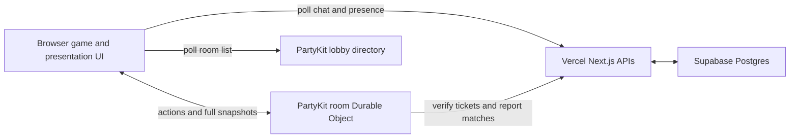
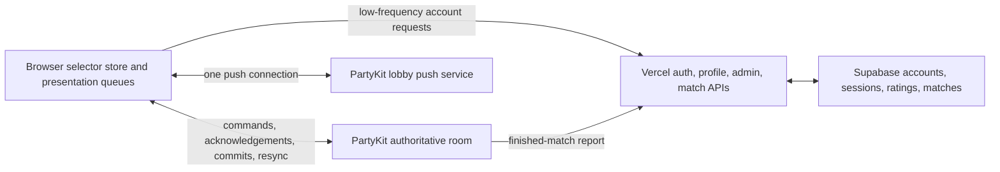

# Multiplayer Performance and Scaling Upgrade Plan

- Status: implementation-ready plan
- Audit date: 2026-07-12
- Scope: PartyKit room transport, browser state/rendering, Vercel APIs, Supabase, and the multiplayer lobby
- Primary objective: remove refresh-required freezes and keep interaction smooth as concurrent players, rooms, and observers increase

## 1. Executive decision

Keep the current platform split:

- PartyKit / Cloudflare Durable Objects remain authoritative for live game rooms.
- Vercel serves the Next.js application and low-frequency account/admin/report APIs.
- Supabase Postgres remains the durable store for accounts, sessions, socket tickets, ratings, and match history.
- Do not move live `GameState` into Supabase.
- Do not replace PartyKit with Vercel WebSockets as part of this upgrade.

The main problems are duplicated full snapshots, fragile recovery from half-dead sockets, high global lobby polling, and a monolithic browser presentation pipeline. Infrastructure replacement would preserve most of those problems while adding migration risk.

Implement this plan as small, independently deployable slices. Do not begin protocol deltas until exactly-once snapshot ingestion, recovery, and instrumentation are proven.

## 2. Current architecture



### Correct ownership boundaries

| Responsibility                               | Owner                        |
| -------------------------------------------- | ---------------------------- |
| Authoritative room state and action ordering | PartyKit room object         |
| WebSocket fan-out                            | PartyKit room object         |
| Static frontend and application routes       | Vercel                       |
| Account/session persistence                  | Supabase                     |
| Ranked results and profiles                  | Supabase through Vercel APIs |
| Local animation and sound presentation       | Browser                      |

Supabase and Vercel are not in the normal per-action room path after a socket identity has been verified. Their load mainly affects connection/authentication, global presence, lobby features, and match completion.

## 3. Audit evidence and baseline

These measurements came from the repository as it existed on the audit date. Re-measure after each implementation phase.

### State and transport

- `src/engine/state-size.test.ts` measured a representative four-player late-game snapshot at 49,553 bytes, or 48.4 KiB.
- Approximately 22.1 KiB of that fixture was `eventLog`, about 45% of the serialized state.
- The event log is correctly capped at 500 entries in `src/engine/events.ts`.
- Hosted actions call `broadcastSnapshot()` and create a separately redacted snapshot for every connection.
- The acting connection also receives another full snapshot inside `action-result`.
- A four-player action can therefore send approximately five full redacted snapshots, up to roughly 242 KiB before WebSocket compression. Observers increase this further.

### Duplicate client ingestion

The successful PartyKit action snapshot currently reaches the acting browser through multiple paths:

1. PartyKit broadcasts the snapshot to every connection in `party/index.ts`.
2. `connectPartyRoom` calls `handlers.onSnapshot` for the successful `action-result` in `src/lib/realtime.ts`.
3. `submitAction` calls `ingestSnapshot(payload.snapshot, { seatAuthoritative: true })` in `src/app/page.tsx`.

The version gate drops some same-version frames, but the seat-authoritative upgrade deliberately permits one equal-version ingestion. In the normal broadcast-then-result ordering, this causes the actor to perform presentation ingestion twice.

### Snapshot correctness risk

`ingestSnapshot` currently invokes `ingestServerState` from inside the functional updater passed to `setRoomVersion`. React updater functions must be pure and may be invoked more than once in development checks. `ingestServerState` performs timers, local state changes, sound/FX planning, match claims, and mutable ref updates, so it must not execute inside a state updater.

### Browser work

- `src/app/page.tsx`: approximately 5,513 lines and 264 KiB source.
- `src/components/adventure/screen.tsx`: approximately 6,641 lines and 278 KiB source.
- `src/engine/legal-actions.ts`: approximately 8,285 lines.
- `src/engine/reducer.ts`: approximately 18,586 lines.
- Snapshot ingestion contains 27 `eventLog.filter` passes and many nested scans.
- The page owns about 36 state hooks, 42 refs, and 62 presentation setter calls in the ingestion area.
- No `React.memo` component boundaries or transition APIs exist in the main table tree.
- The production root entry contains approximately 1.69 MiB raw / 374 KiB gzip JavaScript and 56 KiB gzip CSS.

One local Node benchmark of the late-game fixture measured `getPlayerView` and redaction below 1 ms each and `getLegalActions` much lower for that particular state. These numbers do not represent slow phones or worst-case game phases, but they show that cloning and legal actions must be profiled before being treated as the primary problem.

### Lobby and presence scaling

`src/components/room-browser.tsx` refreshes every three seconds and starts three requests:

- PartyKit room-directory GET.
- Vercel lobby-chat GET.
- Vercel presence POST.

That is 60 client requests per minute per lobby browser, including 40 Vercel invocations. At 1,000 lobby users, the polling pattern alone produces approximately 40,000 Vercel invocations per minute.

While inside a room, each browser sends presence to Vercel every 12 seconds. Signed-in presence resolves the session through Supabase, producing five presence invocations per minute per player even though PartyKit already owns the live room connection.

### Vercel packaging

The production build succeeds, but Next.js warns that dynamic filesystem access in `game-room-store.ts` makes output tracing overly broad. Each built-in room action/stream function currently traces approximately 947 files and 115 MiB, including development art under `scripts/`.

This is mainly a deployment and cold-start problem for the built-in fallback backend. PartyKit-hosted actions bypass these functions, but the packaging should still be fixed.

## 4. Review of the original lag reference

The reference note is useful as initial triage but must not be implemented literally.

| Reference claim                                                | Decision                                                                                     |
| -------------------------------------------------------------- | -------------------------------------------------------------------------------------------- |
| PartyKit can stay apparently open while updates stop           | Valid and still needs a watchdog                                                             |
| PartyKit lacks wake/focus resync                               | Valid for room synchronization; the existing visibility handler only updates global presence |
| Successful actions are ingested twice                          | Valid                                                                                        |
| Full snapshots and per-seat redaction amplify with connections | Valid                                                                                        |
| Event-log scans and the monolithic UI deserve refactoring      | Valid                                                                                        |
| `getLegalActions` is definitely a primary bottleneck           | Not proven; instrument first                                                                 |
| Replace JSON cloning with `structuredClone`                    | Do not do blindly; benchmark and prefer structural sharing                                   |
| Use `startTransition`                                          | Only after duplicate work is removed; it schedules work but does not reduce it               |
| Poll a full HTTP snapshot every 4-10 seconds                   | Reject as written; it would repeatedly mint/verify Supabase tickets                          |
| Presentation timers can look like desynchronization            | Valid and requires a watchdog/skip path                                                      |
| Move to deltas                                                 | Valid as a later protocol phase                                                              |

## 5. Target architecture



Design properties:

- One authoritative serial action queue per room.
- Exactly one accepted client ingestion per room version and viewer seat.
- Lightweight health frames instead of periodic full snapshots.
- Full snapshots only for connection, recovery, version gaps, and checkpoints.
- Lobby directory, chat, and presence are pushed instead of polled.
- Presentation queues cannot block or discard authoritative interaction state.
- Per-seat redaction happens before any delta generation.
- Every new protocol path has a full-snapshot fallback.

## 6. Phase 0: instrumentation and performance contract

Do this first. Without it, later changes can move latency around without proving improvement.

### 6.1 Client measurements

Add a small `src/lib/performance-metrics.ts` abstraction. It should be no-op unless sampling is enabled.

Record these timestamps using the existing action `requestId` and snapshot version:

1. User input received.
2. Action validation completed.
3. WebSocket send called.
4. Acknowledgement received.
5. Snapshot/commit received.
6. Version accepted by the snapshot arbiter.
7. Presentation delta derived.
8. React state/store updated.
9. First `requestAnimationFrame` after update.

Also record:

- Incoming/outgoing frame byte length.
- Frame type and action type.
- Current room connection count when supplied by the server.
- Event count and event-log length.
- Reconnect, health timeout, HTTP fallback, and version-gap counters.
- Presentation duration and watchdog/skip activations.
- Browser Long Tasks and INP where supported.

Never include player names, room passwords, card identities, raw tokens, or unredacted state in telemetry.

### 6.2 Server measurements

Instrument `party/index.ts` around:

- Message parse.
- Identity resolution.
- Time waiting in `mutationQueue`.
- `applyAction` and computer/AFK settlement.
- Storage persistence.
- Redaction by distinct viewer seat.
- Serialization.
- Broadcast completion.
- Lobby report and finished-match report, recorded separately from action acknowledgement latency.

### 6.3 Initial service-level objectives

- Manual refresh required for synchronization: zero.
- Duplicate presentation ingestion for one event id: zero.
- Version rollback: zero.
- Recovery after wake or a detected dead socket: under five seconds.
- p75 INP on the supported device tier: under 200 ms.
- Action latency dashboards split network/server/client rather than one combined number.
- No hidden-information leak in snapshots, patches, logs, or telemetry.

Establish actual regional p50/p95 action targets after gathering a production baseline. Do not invent one global latency threshold for players on different continents.

## 7. Phase 1: exactly-once synchronization and recovery

This is the highest-priority implementation phase.

### 7.1 Build a pure snapshot arbiter

Create a focused module or hook, for example `src/lib/room-snapshot-arbiter.ts`.

Inputs:

- Snapshot.
- Source: `connect`, `broadcast`, `action-ack`, `sync`, `http-recovery`, or `reset`.
- Whether the source is seat-authoritative.
- Current accepted `bootId`, version, viewer seat, and seat-upgrade version.

Output:

```ts
type SnapshotDecision =
  | { accept: false; reason: "older" | "duplicate" | "wrong-seat" }
  | { accept: true; reason: "newer" | "new-boot" | "seat-upgrade" };
```

Requirements:

- The decision function is pure.
- Keep accepted version/boot/seat in refs updated synchronously before presentation work.
- Call `setRoomVersion` with a value, not an updater containing side effects.
- Invoke `ingestServerState` exactly once after an accept decision.
- Cache and local-storage recovery writes occur only after acceptance.
- Reset and room-switch explicitly clear arbiter state.

Tests must cover:

- Broadcast followed by same-version action acknowledgement.
- Action acknowledgement followed by a delayed broadcast.
- Observer frame followed by equal-version seat-authoritative frame.
- Repeated HTTP polling of the same version.
- New `bootId` with a lower version.
- Old boot frame arriving after the new boot.
- Room switch to a lower version.

### 7.2 Make action results acknowledgement-only

Protocol v1-compatible first step:

```ts
type ActionAck = {
  type: "action-result";
  requestId?: string;
  version: number;
  errors: { code: string; message: string }[];
  notices?: string[];
};
```

Rules:

- The normal room broadcast remains the source of the accepted state.
- `action-result` resolves/rejects the pending request but does not call `onSnapshot`.
- The acknowledgement carries notices currently needed by the actor, including refund reasons.
- WebSocket ordering guarantees the broadcast frame is queued before the acknowledgement because the server awaits broadcasting first.
- On an action error, no new state version is expected. The client may request sync only when the acknowledgement version differs from its accepted version.
- Retain request-id deduplication.

This removes one full actor frame and one actor ingestion per successful action without changing the authoritative state model.

### 7.3 Add lightweight PartyKit health frames

Extend protocol types:

```ts
type ClientHealthMessage =
  | { type: "ping"; knownVersion: number }
  | { type: "sync"; knownVersion?: number };

type ServerHealthMessage =
  | { type: "pong"; version: number; viewerSeat?: string }
  | { type: "snapshot"; snapshot: RoomSnapshot };
```

Client behavior:

- Update `lastMessageAt` for every valid server frame.
- When the visible tab has received nothing for 30-45 seconds, send `ping`.
- If `pong.version` is newer, send `sync`.
- If no pong arrives within a short timeout, mark the connection unhealthy and perform the HTTP recovery fetch.
- On `focus` or visible `visibilitychange`, send `sync` immediately.
- Never poll a full snapshot every few seconds while the socket is healthy.

Server behavior:

- `ping` returns only `pong`; it must not serialize a full snapshot.
- `sync` returns the current seat-redacted snapshot.
- Do not add server `setInterval` or `setTimeout` heartbeats because scheduled callbacks interfere with Durable Object hibernation.

### 7.4 Cache socket tickets in the browser

Current recovery GETs call `fetchSocketToken()` and mint a fresh Supabase ticket. Change the token endpoint to return:

```ts
{
  token: string;
  expiresAt: number;
}
```

Add an in-memory client cache that:

- Reuses the ticket until a safe margin before expiry.
- Deduplicates concurrent mint requests with one shared promise.
- Clears on logout or an authentication failure.
- Does not persist the ticket to localStorage.

The socket, initial HTTP seat fetch, wake sync fallback, and admin room calls should share the cached ticket.

### 7.5 Presentation safety

- Keep authoritative `GameState` acceptance independent from animation state.
- Queue interaction prompts even when dice/combat presentation temporarily hides them.
- Add a visible "Skip animation" action.
- Apply a maximum duration to every computed presentation timeline.
- When a watchdog fires, clear visual holds but do not alter authoritative game state.
- Record watchdog reason, planned duration, actual duration, and snapshot version.

### Phase 1 release gate

- All snapshot-ordering tests pass.
- Existing concurrency, privacy, reconnect, room-action, and engine tests pass.
- Two-browser test survives sleep/wake and network offline/online without refresh.
- Each new event id produces presentation once on the actor and once on other seats.
- Successful actor traffic contains one broadcast snapshot plus one small acknowledgement, not two full snapshots.

## 8. Phase 2: replace lobby and presence polling with push

This is the largest population-scaling improvement.

### 8.1 Extend `party/lobby.ts`

Add one WebSocket connection per browser while it is in the lobby or a room. Support:

```ts
type LobbyClientMessage =
  | { type: "hello"; clientId: string; token?: string; name: string }
  | {
      type: "presence";
      roomId?: string;
      roomName?: string;
      roomStatus?: "setup" | "playing";
    }
  | { type: "chat"; text: string }
  | { type: "resync" };

type LobbyServerMessage =
  | {
      type: "initial";
      rooms: RoomDirectoryEntry[];
      players: PresenceEntry[];
      chat: LobbyChatMessage[];
    }
  | { type: "room-upsert"; room: RoomDirectoryEntry }
  | { type: "room-remove"; roomId: string }
  | { type: "presence-upsert"; player: PresenceEntry }
  | { type: "presence-remove"; clientId: string }
  | { type: "chat"; message: LobbyChatMessage };
```

### 8.2 Presence model

- Presence lifetime follows WebSocket lifetime instead of periodic Vercel POSTs.
- Verify a signed-in identity once when the lobby connection opens using the cached ticket.
- An open room connection may update the player's room/status through the lobby socket.
- `onClose` removes ephemeral presence and broadcasts the removal.
- Persist only what must survive hibernation. Presence itself is ephemeral; bounded chat may be stored if continuity across hibernation is desired.

### 8.3 Directory storage

Do not rewrite one full `records` array on every room update at larger scale.

- Store `room:<roomId>` records independently.
- Broadcast only the changed room entry.
- On initial/resync, list the prefix and construct the current directory.
- Preserve stale-room pruning and existing shared derivation rules.

### 8.4 Migration

1. Add lobby WebSocket behind `NEXT_PUBLIC_LOBBY_PUSH_ENABLED`.
2. Keep the existing HTTP GET endpoints as initial fallback.
3. When push connects, stop all three-second polling.
4. On push failure, use adaptive HTTP fallback with an in-flight guard and exponential backoff.
5. Remove twelve-second in-room Vercel presence after push has proven stable.

### Phase 2 release gate

- Stable lobby clients make no recurring Vercel chat/presence requests.
- Directory changes, chat, joins, leaves, and room status appear without polling.
- Reconnect obtains one complete initial frame and does not duplicate chat/presence.
- Load test the lobby service with the intended concurrent connection target before removing fallback.

## 9. Phase 3: incremental presentation and render isolation

### 9.1 One incremental event pass

Extract presentation derivation from `page.tsx` into pure modules, for example:

- `src/presentation/event-delta.ts`
- `src/presentation/cue-reducer.ts`
- `src/presentation/timeline.ts`

Use `eventCounter` / numeric event ids:

- On initial connection, perform one pass to prime the last processed event number and reconstruct only active reconnect overlays.
- On a newer snapshot, process events whose number is greater than the last processed number.
- Classify each new event in one switch/pass into feed, dice, movement, notice, FX, morale, turn, and combat groups.
- Advance the processed counter only after the presentation delta is successfully derived.
- If the event log has rotated beyond the expected counter, treat it as a presentation gap: do not replay old events; rebuild required live overlays from state.

Do not maintain many ever-growing `Set<string>` collections when one monotonic event counter can provide the same exactly-once property.

### 9.2 Store separation

Separate three categories:

1. Authoritative accepted room state/version.
2. Derived viewer state and legal actions.
3. Local presentation queues/timers/selections.

Use `useSyncExternalStore` with selectors, or another small selector store, so components subscribe only to the slices they render. Do not add a state library merely to rename the same monolithic rerender.

### 9.3 Component boundaries

Extract and memoize at least:

- `AdventureMapRegion`
- `CombatTableRegion`
- `PlayerDockRegion`
- `RoomSocialRegion`
- `PresentationOverlayRegion`
- `PromptRegion`

Rules:

- Props must be selector results or stable callbacks, not the entire state when unnecessary.
- Map-only calculations must not rerun for combat-only updates.
- Overlay queue changes must not rerender the map or every card.
- Room chat/reactions must not rerun legal-action generation.
- Use React transitions only for non-urgent visual reconciliation after correctness is established. Never transition acknowledgement/error feedback or the authoritative version indicator.

### 9.4 Code splitting

Use `next/dynamic` or `React.lazy` for mutually exclusive heavy branches:

- Setup lobby.
- Adventure table.
- Combat table.
- Rare large modals and preview tools.

Loading a branch may preload likely-next assets, but the first route should not parse all gameplay modes before it becomes interactive.

### 9.5 Clone and legal-action work

After profiling:

- Replace whole-state JSON cloning in `getPlayerView` with structural copying of only redacted branches if it is a measured long task.
- For hosted frames, consider a render-ready player-view protocol only if legal-action generation no longer requires the full GameState-compatible shape.
- Keep open-table seat switching working.
- Do not substitute `structuredClone` without before/after measurements on supported browsers.
- Cache legal actions by accepted version and viewer seat; do not compute them from local animation state.

### Phase 3 release gate

- React Profiler shows unrelated regions no longer rerendering.
- Incremental event tests cover multiple events in one snapshot, rotation, reconnect, duplicate snapshot, and room switch.
- No existing animation ordering or prompt visibility regression.
- Production entry bundle and hydration/interaction timings improve relative to the Phase 0 baseline.

## 10. Phase 4: protocol v2 state commits

Begin only after Phases 1-3 are stable.

### 10.1 Frame model

```ts
type RoomProtocolV2 =
  | { type: "snapshot"; protocol: 2; version: number; state: GameState }
  | {
      type: "commit";
      protocol: 2;
      fromVersion: number;
      toVersion: number;
      patch: JsonPatchOperation[];
    }
  | {
      type: "ack";
      protocol: 2;
      requestId: string;
      version: number;
      errors: EngineError[];
      notices?: string[];
    }
  | { type: "pong"; protocol: 2; version: number }
  | { type: "resync-required"; protocol: 2; version: number };
```

### 10.2 Security and reconstruction rules

- Generate a patch by comparing the previous and next states after both have been redacted for the same viewer seat.
- Never generate a canonical patch and attempt to redact individual operations afterward.
- Cache serialized commits by `fromVersion + toVersion + viewerSeat`.
- Group connections by effective viewer seat; observers share one frame.
- Client applies a commit only when `fromVersion` equals its accepted version.
- Validate the reconstructed state before acceptance in development/tests.
- Any mismatch requests a full snapshot.
- Full snapshots remain the recovery authority.

### 10.3 Commit retention

- Keep a bounded in-memory ring of recent commits for short reconnects if measurements justify it.
- If the client's version is within the ring, replay missing commits in order.
- Otherwise send one current full snapshot.
- Do not weaken room persistence: the authoritative next state must still be durable before clients are told the action succeeded.

### 10.4 Compression

- Inspect actual production WebSocket extension negotiation before adding application compression.
- If full frames are not already compressed, consider gzip only for full snapshots above a measured threshold.
- Do not gzip small acknowledgements, health frames, or small commits.
- Record encoded and decoded byte sizes and decompression time.

### 10.5 Compatibility rollout

- Client announces supported protocol versions on connect.
- Server keeps protocol v1 full snapshots until v2 is proven.
- Feature flag v2 by room or sampled percentage.
- A v2 client must accept a full v1-style recovery snapshot during rollback.

### Phase 4 release gate

- Patch reconstruction deep-equals the expected redacted next state for every seat and observer.
- Privacy tests scan serialized commits for opponent hands, deck order, face-down tiles, password hashes, and private choices.
- Version-gap, reordered-frame, duplicate-frame, reconnect, and server-deploy tests pass.
- Average bytes per normal action materially improve without increasing p95 server CPU or browser INP.

## 11. Phase 5: Vercel and Supabase hardening

### 11.1 Region alignment

- Determine the actual Supabase project region.
- Configure Vercel account/session/match functions in a nearby supported region.
- Measure PartyKit-to-Vercel ticket verification and match-report latency before and after.
- Do not choose a region from the developer's location alone; place compute near its data source and player distribution.

### 11.2 Ticket RPCs

Current ticket connection flow performs multiple PostgREST requests:

- Mint: resolve session row, load account, insert ticket.
- Verify: load ticket, load account.

Create transactional SQL functions exposed through controlled server-side RPC calls:

- `homm3bg_mint_socket_ticket(session_digest, ticket_digest, now, expires_at)`.
- `homm3bg_verify_socket_ticket(ticket_digest, now)`.

Requirements:

- Callable only with the server service role.
- Reject expired sessions/tickets and banned/deleted accounts.
- Return only the minimal verified identity.
- Keep raw token values out of Postgres; store digests only.
- Preserve the existing ten-minute ticket policy and revocation semantics.

### 11.3 Atomic match updates

Move match idempotency, participant rating reads, rating updates, counters, and match-row insertion into one database transaction/RPC. This removes the documented race where simultaneous different matches involving one account can compute from the same old rating.

### 11.4 Next.js output tracing

Either isolate runtime room persistence from project-root dynamic paths or extend tracing exclusions for files never needed by serverless room functions:

- `scripts/**`
- `docs/**`
- `tests/**`
- `sounds-incoming/**`
- source test/spec files
- other generation-only artifacts

After each change, build and calculate the referenced size of room function `.nft.json` files. Do not exclude runtime data or modules merely to silence the warning.

### 11.5 Production configuration safety

- Add an operator-visible configuration health endpoint or deployment check.
- If PartyKit is required in production, do not silently route multiplayer to the Vercel in-memory/filesystem fallback when `NEXT_PUBLIC_PARTYKIT_HOST` is missing.
- Keep the built-in backend available for local development and explicit self-hosting.
- Verify the app and PartyKit deployments expose matching `ENGINE_SIGNATURE` values before broad rollout.

## 12. Test and load matrix

### Unit tests

- Snapshot arbiter decisions.
- Health timeout state machine.
- Ticket cache expiry and concurrent request deduplication.
- Incremental event classification.
- Presentation watchdog.
- Protocol patch reconstruction and privacy.
- Lobby presence close/reconnect behavior.

### Integration tests

- Broadcast then acknowledgement ordering.
- Concurrent room actions remain serialized.
- Request-id retry applies once.
- Socket appears open but drops pong responses.
- Focus/wake resync.
- HTTP fallback with a reused ticket.
- Hosted observer-to-seat same-version upgrade.
- Lobby push reconnect with initial state.
- PartyKit match report through Vercel to Supabase.

### Browser tests

- Two and four real browser contexts.
- Actor and non-actor animation exactly once.
- Background tab and laptop-sleep simulation.
- Offline/online transitions.
- Slow CPU and slow network profiles.
- Long combat presentation with skip/watchdog.
- Large map, parallel turns, chat, reactions, and observers.

### Load profiles

Run separately so bottlenecks can be attributed:

1. Many rooms with two players each.
2. Fewer rooms with four players and multiple observers.
3. High action frequency from parallel turns.
4. High lobby concurrency with low room activity.
5. Reconnect storm after a simulated network interruption.
6. Supabase ticket mint/verification burst.

Collect p50/p95/p99 for server queue, reducer, persistence, redaction, serialization, network, ingestion, and paint.

## 13. Rollout and rollback strategy

### Slice A: safe synchronization

- Metrics.
- Pure snapshot arbiter.
- Acknowledgement-only action result.
- Health ping/pong and wake sync.
- Cached tickets.
- Presentation watchdog.

No state schema or delta protocol change.

### Slice B: lobby push

- PartyKit lobby WebSocket behind a flag.
- Stop polling only after push is connected.
- Preserve HTTP fallback.

### Slice C: browser isolation

- Incremental event derivation.
- Selector store.
- Memoized render regions.
- Dynamic imports.

Deploy region by region or sampled sessions while comparing INP and error rates.

### Slice D: protocol v2

- Dual-protocol server.
- Small canary percentage.
- Automatic fallback to snapshot on any gap or reconstruction error.
- Expand only after privacy and latency dashboards remain clean.

Rollback must never require a database migration to restore gameplay. Keep v1 snapshots and HTTP resync operational through the entire v2 rollout.

## 14. Definition of done

The upgrade is complete only when all of the following are true:

- Players do not need manual refresh after sleep, transient network loss, or a half-dead socket.
- Every accepted room version is ingested once per viewer context.
- Every presentation event is shown at most once unless explicitly replayable.
- Animations cannot permanently hide a required interaction.
- Stable lobby and in-room clients do not generate periodic Vercel presence/chat polling.
- Room action latency is attributable through metrics and meets the agreed regional objectives.
- p75 INP is below 200 ms on the supported device tier.
- Hosted snapshots and commits pass hidden-information privacy tests.
- Normal action bandwidth is materially lower than the Phase 0 baseline.
- Increased observers do not repeat redaction/serialization for identical observer views.
- Vercel room function traced size is reduced and the broad-tracing warning is resolved or explicitly bounded.
- Supabase ticket and match operations are bounded and transactionally correct.
- Build, typecheck, unit, integration, and multiplayer browser suites pass.

## 15. Explicit non-goals and prohibited shortcuts

- Do not put live authoritative game state in Supabase as a performance fix.
- Do not rewrite the reducer while changing the transport protocol.
- Do not remove full-snapshot recovery.
- Do not trust client-generated patches or client-reported identity.
- Do not generate patches before seat redaction.
- Do not add aggressive full-state polling.
- Do not add server timers that defeat Durable Object hibernation.
- Do not assume `structuredClone`, compression, memoization, or `startTransition` is beneficial without measurements.
- Do not weaken privacy or room action serialization to reduce latency.
- Do not combine all phases into one pull request.

## 16. Recommended first implementation PR

The first code PR after this plan should contain only:

1. Performance metric primitives and sampled logging.
2. Pure snapshot arbiter with comprehensive ordering tests.
3. Acknowledgement-only PartyKit action results.
4. PartyKit `ping`/`pong`, wake `sync`, and HTTP timeout fallback.
5. In-memory socket-ticket cache.
6. Presentation maximum-duration watchdog and skip control.

This slice directly addresses refresh-required freezes and duplicate actor work without changing the engine, database schema, room persistence model, or normal full-snapshot broadcast format.

## 17. Primary implementation files

| Area                          | Existing files likely changed                                            |
| ----------------------------- | ------------------------------------------------------------------------ |
| PartyKit room protocol        | `party/index.ts`                                                         |
| Client transport and recovery | `src/lib/realtime.ts`, `src/lib/realtime.test.ts`                        |
| Snapshot acceptance           | new `src/lib/room-snapshot-arbiter.ts` plus tests                        |
| Page ingestion integration    | `src/app/page.tsx`                                                       |
| Presentation extraction       | new `src/presentation/*`, later phase                                    |
| Lobby push                    | `party/lobby.ts`, `src/components/room-browser.tsx`                      |
| Presence/chat fallback        | `src/app/api/lobby-presence/route.ts`, `src/app/api/lobby-chat/route.ts` |
| Ticket cache/API              | `src/lib/auth-client.ts`, `src/app/api/auth/socket-token/route.ts`       |
| Supabase RPC integration      | `supabase/schema.sql`, `src/server/accounts/supabase-store.ts`           |
| Vercel tracing                | `next.config.ts`, possibly room-store module isolation                   |
| Load and browser coverage     | `tests/e2e/*`, new focused load scripts                                  |

Treat this document as the sequencing authority. If measurements contradict a suspected bottleneck, preserve the correctness phases and revise only the performance-specific priority with recorded evidence.
