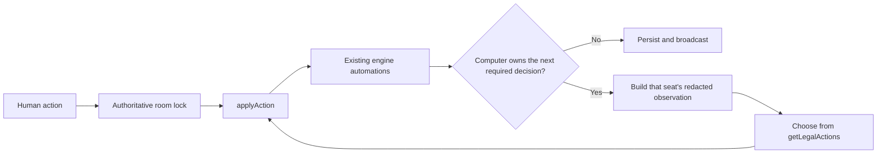

# Single-player mode with computer opponents

Status: foundation implemented; user-facing mode and strategic play are not implemented yet. Do not describe Single Player as available until the deferred work below is complete.

Implemented foundation (July 2026):

- persisted `sessionMode` and per-seat human/computer controllers with legacy-safe defaults;
- atomic `SET_COMPUTER_OPPONENTS` setup action and normal legal-action exposure;
- one-human plus 1-3-computer lobby/game construction and reset/build preservation hooks;
- private room creation metadata, first-owner binding to `p1`, and unrelated-join rejection;
- built-in directory, shared registry, PartyKit reporting, account/MMR, reset-vote, and AFK isolation;
- explicit trusted reducer authority for in-process computer actions (not client-deserializable);
- redacted computer observation, required-decision owner detection, deterministic legal-action policy shell;
- transport-neutral bounded runner with progress detection and explicit stall reporting;
- focused controller, authority, window, runner, privacy, and match-report tests.

Still deferred intentionally:

- the Single Player menu/creation/setup UI;
- wiring the runner into live Next and PartyKit action transactions;
- production-quality map, economy, Event, card, and combat strategy policies;
- thinking presentation, reconnect/resume integration, broad interaction coverage, and soak tests.

This document is an implementation contract for an automated contributor. It is intentionally specific to this repository. Follow the phases in order, preserve the existing neutral-army rules, and do not replace engine behavior with UI-only labels.

## 1. Product contract

Add a real **Single player** path from the main menu. It creates one human-controlled seat and between one and three computer-controlled seats, subject to the selected scenario's supported player count.

The setup screen must visibly say **Playing with computer** and provide a **Computer opponents** control. The legal values are derived from the scenario: `1..(maximum seats - 1)`. The total player count is always `1 + computerOpponents` in this mode.

The human configures the normal game options and chooses their own faction/hero. Computer seats choose their own legal faction/hero through the normal setup action pipeline. The human then starts the adventure normally.

After the adventure starts, a computer seat is a normal player in every rules-relevant sense:

- it owns a normal `PlayerState`, town, heroes, hand, deck, army, resources, buildings, movement points, combat units, and victory/elimination state;
- it receives the same legal actions and pays the same costs as a human;
- its decisions are submitted through `applyAction`; it must never mutate game state directly;
- it may fight neutral guards, Creature Banks, or another player, build, recruit, discover, revisit, resolve Events/Astrologers, cast cards, react, retreat, surrender, give up, and win or lose;
- hidden information remains hidden from the human, and the computer policy must not read opponents' private hands/decks;
- one human plus multiple computers is supported; zero-human simulation is not a user-facing mode.

Single-player rooms must never appear in the multiplayer room directory, must never count toward MMR, and must not participate in multiplayer AFK votes or ready checks.

## 2. Important distinction: computer players are not neutral AI

Keep `src/engine/neutral-ai.ts` and the existing neutral automation in `src/engine/reducer.ts` semantically unchanged.

There are two separate concepts:

| Concept | Controller | Rules/state | Required behavior |
| --- | --- | --- | --- |
| Neutral guard | Reserved `NEUTRAL_PLAYER_ID` | Existing neutral combat rules | Preserve current target, movement, reaction, time-limit, and player-choice rules |
| Computer opponent | A normal seat such as `p2` | Same rules as a human player | Select a legal human action automatically |

A computer player's hero can enter combat with a neutral guard. In that combat, the existing neutral pump controls the guard and the new computer policy controls the normal player seat. Do not convert a computer opponent's army to neutral units and do not reuse `planNeutralActivation` as the player-seat AI.

## 3. Architecture decision

Use a hidden, server-authoritative room for single-player. Do not build a second reducer, a local-only game state, or a browser `setInterval` that clicks buttons.

The existing room architecture already provides persistence, action serialization, random entropy, snapshot recovery, player-view redaction, and parity between the Next API backend and PartyKit. Reusing it prevents these failure modes:

- a background/sleeping browser stopping on a computer turn;
- two tabs submitting the same computer decision;
- a reconnect rerunning an old decision;
- a computer bypassing costs or validation by changing state directly;
- the Next backend and PartyKit behaving differently;
- the human seeing a computer hand because local state contains all players' secrets.

The ownership flow must be:



The computer selector is deterministic and engine-side. The room server supplies fresh action entropy only when applying the selected action, exactly as it does for a human action.

## 4. State and type changes

### 4.1 Add explicit seat controllers

In `src/engine/state.ts`, add:

```ts
export type ComputerDifficulty = "standard";

export type PlayerController =
  | { kind: "human" }
  | {
      kind: "computer";
      difficulty: ComputerDifficulty;
      policyVersion: 1;
    };
```

Add this optional field to `GameState`:

```ts
controllers?: Record<PlayerId, PlayerController>;
```

Compatibility rule: a missing map or a missing entry means `{ kind: "human" }`. Centralize that rule in helpers; do not scatter `?? "human"` checks across the project.

Create `src/engine/computer/control.ts` with at least:

```ts
export function controllerOf(state: GameState, playerId: PlayerId): PlayerController;
export function isComputerPlayer(state: GameState, playerId: PlayerId): boolean;
export function computerPlayerIds(state: GameState): PlayerId[];
export function humanPlayerIdsByController(state: GameState): PlayerId[];
```

Do not infer computer control from a name such as `"Computer 1"`, room membership, or a missing socket. Control is persisted game state.

### 4.2 Mark the session and room as private

Add to `GameState`:

```ts
sessionMode?: "multiplayer" | "single-player";
```

Compatibility rule: absent means `"multiplayer"`.

Add to `RoomMembershipState`:

```ts
visibility?: "public" | "private";
ownerClientId?: string;
ownerUserId?: string;
```

Compatibility rule: absent visibility means `"public"`.

A new single-player room has:

- `state.sessionMode = "single-player"`;
- `state.room.visibility = "private"`;
- `state.room.hosted = true`;
- `state.room.ranked = false`;
- one human room member assigned to `p1`;
- no fake `RoomMember` rows for computer seats;
- a high-entropy, non-guessable room id (at least 128 random bits, not the current six-character public-room suffix).

Bind the private room to its first creator. Prefer verified `ownerUserId`; retain `ownerClientId` for guest mode. Reject later `JOIN_ROOM` attempts from a different owner. This prevents a guessed/shared URL from becoming a spectator view of a supposedly private game.

### 4.3 Add a setup action

Add this `GameAction` variant:

```ts
{
  type: "SET_COMPUTER_OPPONENTS";
  playerId: PlayerId; // the human making the setup change
  count: number;
}
```

Implement it in `src/engine/adventure-setup.ts`, wire it in `src/engine/reducer.ts`, and expose it from `getSetupLobbyLegalActions` only when all of these are true:

- `sessionMode === "single-player"`;
- phase is setup and `setupLobby` exists;
- `playerId` is the sole human controller;
- no start-ready check is open.

The handler must atomically:

1. clamp the requested count to the selected scenario's capacity;
2. resize the lobby to `1 + count` seats using the existing seat-resize path;
3. preserve `p1` as human;
4. mark every other live seat as a standard computer;
5. name them `Computer 1`, `Computer 2`, and `Computer 3` in both the setup seat and `PlayerState`;
6. remove controller entries for trimmed seats;
7. clear draft rolls/picks that became invalid because the roster changed;
8. update `GameSetupOptions.playerCount`.

Do not expose this action in multiplayer. Do not let `SET_GAME_OPTIONS.playerCount` produce human seats in single-player; either route that UI through `SET_COMPUTER_OPPONENTS` or make the setup sanitizer reassert the single-player controller invariant.

### 4.4 Preserve control through game construction and reset

`buildAdventureFromLobby` currently builds a new game and copies room membership back. Extend it to copy `sessionMode` and the controller map.

`createAdventureGameState` must accept optional controller/session configuration and stamp it onto the built state. Direct test factories with no configuration remain multiplayer/all-human.

Room resets/rematches must preserve:

- single-player session mode;
- private visibility and owner;
- the number of computer seats and their difficulty;
- the one human seat assignment.

Do not require a multiplayer reset vote for a single-player game. The owner can start a new adventure directly.

## 5. Single-player creation and UI

### 5.1 Main menu and route

In `src/app/menu/page.tsx`, replace the disabled Single player button with a link to `/single-player`. Remove the obsolete comments saying the mode is outside scope.

Create `src/app/single-player/page.tsx`. It should show a short creation panel with:

- heading: `Playing with computer`;
- `Computer opponents` selector;
- default: one computer;
- a `Create game` button;
- optional scenario picker only if it can derive the valid computer range before creation; otherwise scenario changes remain in normal setup.

On create, mint a private single-player room and navigate to `/?room=<id>`. Add a purpose-built `createSinglePlayerRoom` API in `src/lib/realtime.ts`; do not overload public room creation with UI assumptions.

For the built-in backend, extend `/api/rooms` creation options and `makeRoom` so the first persisted snapshot is private/single-player before it can ever be listed.

For PartyKit, rooms are created implicitly on first connection. Carry an unforgeable or fresh-room-only `singlePlayer=1` creation marker on the first connection. In `party/index.ts`, apply it only when the snapshot is fresh, has no members, and has not been configured. Mark the state private before `reportToLobby` can run. A later connection must not be able to change an existing public room into another mode.

The PartyKit `onConnect` order for a new single-player room must be:

1. ensure fresh snapshot;
2. apply fresh-room single-player metadata and controllers;
3. persist;
4. join/bind the owner and assign `p1`;
5. send the redacted owner snapshot;
6. skip directory reporting;
7. start the computer runner if setup already requires a computer decision.

Avoid even a temporary public lobby record.

### 5.2 Setup screen

Update `SetupLobbyScreen` and `GameOptionsPanel` in `src/components/adventure/screen.tsx`:

- show a `Computer` badge/icon on computer seats;
- replace the multiplayer `Players` control with `Computer opponents` in single-player;
- show the human as `You`/their display name and computers as `Computer N`;
- do not offer seat switching, hosting, kicking, invite, chat, ranked, or authentication controls for computer seats;
- the human can inspect all public faction/hero picks but cannot switch the viewer to a computer seat;
- computers automatically complete free pick, random, random-choice, and draft/ban setup through normal setup actions;
- computers never change global game options and never press `START_ADVENTURE`;
- the New Game button remains a human decision.

The existing ready-check logic derives confirmers from real room members, so computer seats must not be included. Add explicit tests: one human plus three computers starts immediately after the human presses Start; a normal hosted two-human room still requires both confirmations.

### 5.3 In-game presentation

The normal opponent UI should render computer players with a `Computer` marker. Do not reveal their hand or private card zones.

While the authoritative runner is working, show `Computer N is thinking...` using a small public runner status, or a transport status frame. It must not be implemented as a delay that gates correctness. Animation can lag behind already-resolved events; rules progression must not wait for client animation callbacks.

Hide or disable multiplayer-only affordances in single-player:

- room invite/share controls;
- lobby/room chat if desired (table event feed remains);
- host/seat reassignment controls;
- AFK vote and turn-timeout controls;
- ranked/MMR labels;
- observer language.

## 6. Keep single-player out of the multiplayer lobby

Implement defense in depth; one filter is not enough.

### Built-in room store

In `src/server/game-room-store.ts`, `listRooms` must skip any record whose state is single-player or whose room visibility is private before deriving a directory entry.

### Shared lobby registry

Add `visibility` and `sessionMode` to `LobbyRoomRecord` only if needed for defensive filtering. `LobbyRegistry.upsert` and/or `list` must refuse private/single-player records. Include the fields in `lobbyRecordSignature` if records retain them.

### PartyKit room

In `party/index.ts`, `reportToLobby` must call `deregisterFromLobby` and return when the room becomes private/single-player. It must never `POST` that record. This also cleans up a stale public record after migration or recovery.

### Ranking and presence

`detectFinishedMatch`/match reporting must return no ranked report for `sessionMode === "single-player"`, even if a corrupt legacy snapshot says `ranked: true`.

Lobby presence may show the owner as generally online, but must not publish a joinable room id for a private game.

Required tests must cover all three directory layers, not only the React room filter.

## 7. Computer decision subsystem

Create this directory:

```text
src/engine/computer/
  control.ts       controller/session helpers and compatibility defaults
  observation.ts   safe computer-visible state construction
  window.ts        decides which seat currently owes an automatic decision
  policy.ts        top-level action selection and total fallback
  setup-policy.ts  faction/hero/draft decisions
  map-policy.ts    movement, economy, town, visit, event decisions
  combat-policy.ts placement, activation, target, card, retreat decisions
  score.ts         shared resource/card/unit/position scoring helpers
  types.ts         ComputerDecision and diagnostic types
  index.ts         narrow public exports
```

Create `src/server/computer-runner.ts` for orchestration. Engine policy must remain network-free and deterministic; persistence, locks, entropy, and broadcasts belong to the server runner/transports.

### 7.1 Observation: the computer must not cheat

The room server has the full `GameState`, but the policy must receive only:

```ts
type ComputerObservation = {
  state: PlayerVisibleState; // getPlayerView(fullState, computerPlayerId)
  legalActions: LegalAction[]; // getLegalActions(fullState, computerPlayerId)
};
```

It is acceptable for legality generation to use full state because the engine already does that for every player. Scoring/evaluation must use the redacted state and the computer's own private zones only. Add tests proving a decision is unchanged when an opponent's hidden hand/deck order changes while all visible facts and legal actions remain equal.

Never parse `LegalAction.label`. Labels are presentation and may change. Inspect `legal.action.type`, ids, targets, the redacted state, and card/building/unit definitions.

### 7.2 Decision result

Use a diagnostic result:

```ts
export type ComputerDecision = {
  playerId: PlayerId;
  action: GameAction;
  policy: string;
  score: number;
};
```

The selected `action` must be structurally equal to one action returned by `getLegalActions` for that seat at that exact state version. Assert this in development/tests.

Tie-breaking must be stable: sort candidates by a canonical action key, then use a seeded policy RNG based on game seed, round, event counter, player id, and policy version. Do not use `Math.random`, `Date.now`, array insertion accidents, or localized labels.

### 7.3 Determine who owes a decision

`computerDecisionOwner(state)` must return a computer seat only when that seat owns a real action window. It must not make every inactive computer spend optional anytime cards just because `getLegalActions` returns some off-turn possibilities.

Check in this priority order:

1. `pendingChoice.playerId`;
2. `reactionWindow.priorityPlayerId`;
3. the round-start Event/Astrologers resolver from `roundStartEventResolver`;
4. pending visit/tile/far-tile/garrison/necromancy interaction owner;
5. combat setup/placement/tactics participant currently required to act;
6. controller of `combat.activeUnitId`;
7. combat participant who must acknowledge an outcome;
8. ordered `activePlayerId`;
9. computer seats with an open parallel turn, in `turnOrder` order;
10. incomplete computer setup seat whose draft phase permits an action.

Return `null` when the next required owner is human, neutral, table-internal automation, or no one. Existing neutral automation runs inside `applyAction` before this check.

Write direct unit tests for every owner source. A wrong owner function is the most likely cause of a frozen table or a computer acting out of turn.

### 7.4 Total policy rule

The selector must be total over legal action sets:

1. If there is exactly one legal action, choose it.
2. Apply context-specific policy scores.
3. If no specialized policy recognizes the context, use the generic action-type fallback.
4. If scores tie, use the stable seeded tie-breaker.
5. Never return `null` when the computer is the required owner and at least one legal action exists.

The generic fallback priority is:

1. resolve/confirm a mandatory pending choice;
2. keep a legal die result rather than loop rerolls;
3. pass an optional reaction;
4. finish placement/tactics/activation/combat acknowledgement;
5. complete mandatory start-of-turn hand work;
6. take a legal no-cost beneficial action;
7. end the turn;
8. retreat/surrender/give up only as the final legal exit.

This fallback is safety, not acceptable strategic coverage. Every context encountered by soak tests should gain an explicit policy and a regression test.

## 8. Standard computer policy

Only `standard` difficulty ships initially. Do not add a fake difficulty selector with identical behavior.

### 8.1 Setup

- Never change global game options.
- Never start/cancel the adventure.
- Use only factions not reserved/taken under the existing draft rules.
- In free-pick mode, score the available faction/hero pairs and use seeded tie-breaking; initial scoring may treat all legal pairs equally.
- In random mode, use `RANDOM_ASSIGN_SEAT`.
- In random-choice, roll when necessary, then select one of the offered legal choices.
- In draft, roll/select a town, take the legal ban on the most valuable visible opposing hero, then pick a non-banned own hero.
- Do not reset/re-roll an already valid computer pick unless the current draft format requires it.

### 8.2 Mandatory choices and Events

Create a registry keyed by pending-choice type plus context/kind. Cover all choice families returned by `getLegalActions`, including `OPTION_CHOICE`, deck search, combat discard, roll keep/reroll, ability target, Event auction/deal/pool choices, visits, tile rotation/placement, garrison, recruit, Necromancy, Pandora, market, spell book, and commander choices.

General rules:

- accept a free positive result;
- decline an optional harmful or unaffordable result;
- keep resources needed for an immediately affordable high-priority build/recruit;
- choose the resource type currently most scarce relative to known costs;
- discard/remove the lowest-valued eligible card or unit;
- keep the highest-valued revealed card without reading hidden future deck order;
- cap auction bids so the computer retains an emergency gold reserve;
- never repeatedly reroll with no remaining source or benefit;
- optional loops must eventually choose `Done`/decline.

Every loop-like interaction needs a monotonic budget in the policy (cards remaining, repeats remaining, resources remaining, or one explicit "decline after N" counter). Do not rely only on the global runner cap.

### 8.3 Economy and town

On an ordered/parallel map turn, score legal actions in this broad order:

1. mandatory start-of-turn draw/refresh and queued rewards;
2. a winning action available now;
3. recruit/reinforce when it materially improves the army and leaves required reserves;
4. build one legal structure with priorities derived from its implemented effect and current needs;
5. use valuable once-per-round town actions;
6. move heroes toward a scored map objective;
7. optional card/market actions with positive net value;
8. end turn.

Do not build from display text. Use `sampleBuildings`/implemented effect data. Do not spend resources below zero; legal actions prevent this, and invariant tests must prove it remains true.

### 8.4 Adventure movement

Score legal hero movement destinations using public map information:

- immediate victory or enemy-town objective;
- capturable town/settlement/mine;
- favorable player combat;
- favorable neutral/Creature Bank combat;
- unrevealed adjacent tile/discovery;
- useful unvisited location;
- useful revisit;
- progress toward the nearest selected objective;
- avoid a clearly losing combat or pointless backtracking.

Use the engine's legal move/path actions and existing reachability helpers. Do not write a second movement validator. A first implementation may use one-step scoring; add path memory only as persisted, bounded policy state if oscillation is observed in soak tests.

Combat desirability must be conservative. Estimate visible army strength from current unit sides/health, hero level, and known persistent bonuses. Unknown opponent cards are not zero and are not readable; include a fixed uncertainty margin.

### 8.5 Player combat

For placement:

- place durable melee units toward the front;
- keep ranged/support units protected when legal;
- respect Creature Bank and siege special placement through the existing legal actions;
- finish placement once all desired units are placed;
- accept combat and finish tactics rather than waiting.

For each activation:

- first take a legal attack that can remove/flip a high-value enemy;
- otherwise maximize expected damage while minimizing retaliation/exposure;
- prefer ability actions with a positive immediate score;
- move toward a reachable useful target;
- defend when no useful attack/move exists;
- end activation as the fallback.

Target score should include lethal/flip value, damage, enemy grade/attack/initiative, ranged/support threat, retaliation cost, and objective units/fortifications. Use public combat state only.

Cards/reactions:

- pass when no reaction has positive value;
- use damage prevention/lethal save for valuable units;
- use a buff/debuff when it changes a meaningful combat outcome;
- do not spend a card solely because it is legal;
- obey spell limits, expert uses, Power costs, timing, and targets by choosing only generated legal actions;
- retreat/surrender when estimated loss is substantially worse than the legal exit cost;
- acknowledge combat end automatically for a computer participant.

### 8.6 Neutral combat controlled by a computer

The computer resolves its normal player decisions: placement, spells, activations, continue/retreat, and any existing player-owned neutral target/destination tie choices. The guard remains controlled by the existing neutral AI.

At `awaitingContinue`, continue only when the visible surviving army and movement budget make another round worthwhile; otherwise use the normal retreat action. If a +Movement card is legally offered in that window, score its value against the card cost.

### 8.7 Victory and elimination

- A computer is allowed to satisfy any configured victory condition and become `winnerPlayerId`.
- A human win is not assumed merely because the other seats are computers.
- Eliminated computers are removed from owner selection immediately.
- Computer seats do not cast AFK votes and are never AFK targets.
- Reset/start confirmation counts human members only.

## 9. Authoritative computer runner

`src/server/computer-runner.ts` should expose a transport-neutral function similar to:

```ts
export function driveComputerPlayers(
  state: GameState,
  apply: (state: GameState, action: GameAction) => EngineResult,
  options?: { maxSteps?: number }
): {
  state: GameState;
  decisions: ComputerDecision[];
  stalled: boolean;
};
```

The actual signature may use callbacks for persistence/broadcast, but both backends must call the same implementation.

Loop:

1. let existing engine automation settle as part of the preceding `applyAction`;
2. find the required computer owner;
3. stop if none;
4. get that seat's legal actions and redacted observation;
5. choose one action;
6. apply it with `applyAction` and fresh server entropy/time;
7. require success and measurable state progress;
8. persist/version/broadcast as configured;
9. repeat until a human decision, game over, or safety limit.

Run under the same room serialization lock as human actions. Never start a detached runner outside the lock and never allow two runner instances for one room version.

Trigger it after:

- every successful human action;
- single-player room creation/setup configuration;
- room load/recovery/connect when a persisted game is waiting on a computer;
- a reset that leaves computer setup work;
- each successful computer action, until the loop stops.

Do not trigger it after a rejected action.

For the Next store, integrate immediately after the existing AFK forced-resolution step and before final match reporting. For PartyKit, integrate inside `serialized(...)` in both WebSocket and HTTP action paths. Factor the shared "apply, settle forced engine work, then drive computers" sequence so the two PartyKit paths cannot drift.

Persist and broadcast intermediate computer actions when practical so the event/animation feed can present them. Correctness must rely on persisted state, not on a timer between broadcasts. The final response to the human action must contain the fully settled state at the point where human input is next required.

## 10. Anti-freeze and anti-weirdness rules

These are release blockers.

### 10.1 Progress detection

Set a maximum of 256 computer decisions per runner invocation. Most turns should use far fewer. Record the action count in diagnostics.

Before and after each computer action, compute a progress fingerprint containing at least phase, round, active/priority player, pending choice id, reaction window id, combat id/active unit/setup/outcome, pending adventure interaction owners, turn completion ids, event counter, and the selected player's resources/hand/deck/army/hero positions. A successful action with an unchanged fingerprint is a policy/engine bug; do not repeat it.

Track canonical action keys attempted at the same fingerprint. If one unexpectedly fails, recompute legal actions and try the next scored candidate once. Never retry the same state/action forever.

### 10.2 Safe exits

When a computer owns a blocking window, the policy must prefer an existing legal safe exit where appropriate:

- `PASS_REACTION`;
- keep the current roll;
- decline/Done/Skip option;
- `FINISH_COMBAT_PLACEMENT` / `FINISH_TACTICS`;
- `END_ACTIVATION` / defend;
- `ACKNOWLEDGE_COMBAT_END`;
- `END_TURN` / `COMPLETE_SIMULTANEOUS_TURN`;
- retreat, surrender, or give up as last-resort legal actions.

Never fix a stall by deleting `pendingChoice`, `reactionWindow`, `combat`, or a visit queue directly.

### 10.3 Last-resort controlled forfeit

Add an internal-only `FORFEIT_COMPUTER_PLAYER` action only if soak testing demonstrates states in which a required computer owner has no legal exit. It must:

- be accepted only from the authoritative server runner, never a client payload;
- validate that the target is a computer controller;
- reuse the normal give-up/elimination cleanup path;
- append a visible event explaining that the computer conceded because its decision engine could not continue;
- preserve the rest of the game's invariants.

This is preferable to an infinite frozen game, but it is not a substitute for fixing the missing legal action. Any test that reaches it should fail CI unless explicitly testing the fail-safe.

### 10.4 Recovery

If the process/Durable Object restarts on a computer-owned window, the next load or connection must resume from persisted state. The decision tie-breaker is state-derived, so replay chooses the same action for the same version. Once an action is persisted, version serialization prevents applying it twice.

No correctness-critical computer state may live only in a React ref, browser storage, a Node global, or an unawaited PartyKit promise.

## 11. Security and action authority

Do not exploit the current `roomActionGuard` behavior that skips checks when identity is omitted. Introduce an explicit trusted reducer option/capability for computer actions, for example:

```ts
type ReducerOptions = {
  // existing fields...
  computerActorPlayerId?: PlayerId;
};
```

`roomActionGuard` (or a dedicated guard immediately beside it) must accept this only when:

- the action has that same `playerId`;
- `controllerOf(state, playerId).kind === "computer"`;
- the call came from in-process server runner code.

Do not deserialize `computerActorPlayerId` from an HTTP/WebSocket request. Client messages continue to carry only their normal action and actor identity. Add a test proving a human/client cannot forge an action for a computer seat in a hosted single-player room.

## 12. Tests required before calling the feature done

Repository rule `CLAUDE.md` applies: test observable outcomes, not only fields or labels.

### 12.1 Engine/controller tests

Create `src/engine/computer/control.test.ts`:

- missing controller data defaults to human;
- single-player factory creates exactly one human and requested computers;
- resize 1 -> 3 -> 1 computers leaves no stale players/controllers/draft rolls;
- build/reset preserves controllers and session mode;
- computer seats are normal players, not `NEUTRAL_PLAYER_ID`.

### 12.2 Policy tests

Create focused tests beside each policy module:

- selector returns an exact current legal action;
- same seed/state gives the same decision;
- changing hidden opponent cards does not change a decision;
- a one-action mandatory prompt always resolves;
- reactions pass when no beneficial play exists;
- optional repeat loops terminate;
- setup policies complete every draft format;
- movement selects an objective instead of oscillating in a controlled map;
- combat takes a lethal attack over defend/end activation;
- combat ends activation when no useful action exists;
- Event acceptance/decline, discard, bid, and reward choices change resources/cards as expected;
- neutral combat is driven by existing neutral AI plus computer player actions, with an observable combat outcome.

Each heuristic test needs a control candidate so it fails if the relevant score is removed.

### 12.3 Owner/window tests

Create `src/engine/computer/window.test.ts` covering every source in section 7.3, including pending choices, reactions, Event barriers, visits, combat placement, active combat unit, acknowledgement, ordered turns, parallel turns, setup, human block, neutral block, eliminated computer, and game over.

### 12.4 Runner integration tests

Create `src/server/computer-runner.test.ts`:

- after a human ends turn, one computer completes work and control returns to the human;
- with three computers, all three act in order before the human receives control;
- a computer-owned reaction/pending choice resolves automatically;
- a human-owned reaction/pending choice stops the runner;
- a computer can build, recruit, move, enter neutral combat, resolve it, and end turn through validated actions;
- a computer-vs-human combat alternates owners correctly;
- a computer-vs-computer combat settles without browser input;
- a computer can win and game-over state is correct;
- rejected/unchanged decisions do not loop;
- the 256-step limit reports a stall in a deliberately broken fixture;
- restart from a persisted computer window resumes exactly once.

Assert observable state/event changes after each scenario. Merely asserting `decisions.length > 0` is insufficient.

### 12.5 Lobby/privacy/backend parity tests

Extend:

- `src/server/lobby-registry.test.ts`;
- `src/server/game-room-store.test.ts`;
- PartyKit room/concurrency tests;
- API route tests.

Required assertions:

- private single-player room never appears in `listRooms`;
- registry rejects/filters it;
- PartyKit never reports it and deregisters a stale record;
- direct non-owner join is rejected;
- owner sees their own hand but not computer hands;
- computer policy receives its own hand but not human hidden cards;
- a single-player win does not create a match report/MMR change;
- Next and PartyKit produce the same settled engine state for a deterministic action sequence.

### 12.6 UI/component/E2E tests

- main menu Single player is enabled and routes correctly;
- creation screen says `Playing with computer` and defaults to one opponent;
- valid opponent counts follow scenario capacity;
- setup shows computer badges and no multiplayer seat/invite controls;
- changing opponent count updates seats atomically;
- computer faction/hero picks appear without user seat switching;
- one human plus computers starts without a ready-check wait;
- computer thinking indicator appears without blocking recovery;
- multiplayer lobby never shows the created game;
- refresh/reconnect during a computer turn resumes and returns control;
- complete smoke flow: create -> configure -> pick hero -> start -> human turn -> computer turn -> human turn.

### 12.7 Soak tests

Add a bounded simulation harness that uses real legal actions and real reducer calls. In regular CI, run at least 20 fixed seeds for each computer count (1, 2, 3) for a bounded number of rounds. A longer optional/nightly run should execute hundreds of seeds.

For every step assert:

- required computer owner with legal actions always chooses one;
- resources and counters never become negative unless the existing rule explicitly permits it;
- card/unit ids remain unique where required;
- no removed unit remains active;
- pending owner exists and is live;
- turn order contains live normal seats only;
- no computer action is repeated at the same fingerprint;
- no runner invocation exceeds the cap;
- game-over has a valid winner or explicit all-eliminated result;
- no exception, NaN, undefined target, or unresolved choice survives when the next owner should be a computer.

Keep failing seeds as permanent regression tests.

## 13. Implementation phases and gates

### Phase 1: state, creation, privacy

Implement controller/session/visibility types, compatibility helpers, private room creation, owner binding, reset preservation, and lobby/ranking exclusion.

Gate: typecheck; controller tests; built-in and registry privacy tests; PartyKit privacy test. No UI claim that computers play yet.

### Phase 2: setup UX and setup policy

Enable the menu route, add creation/setup controls, atomically resize controllers, and automate all four setup formats.

Gate: component tests plus engine tests showing setup reaches an all-chosen state through real actions. The human still presses Start.

### Phase 3: runner and mandatory-choice coverage

Implement owner detection, redacted observations, total fallback, trusted computer authority, runner integration in both backends, progress detection, and pending/Event choice policies.

Gate: no setup/event/pending/reaction fixture can remain blocked on a computer; backend parity passes.

### Phase 4: map/economy policy

Implement building, recruiting, town actions, objective selection, movement, visits, and end-turn decisions.

Gate: a multi-round integration test shows observable computer growth and movement, then returns control to the human every round.

### Phase 5: combat policy

Implement placement, tactics, activations, targets, player reactions/cards, retreat/surrender, combat acknowledgement, and computer-controlled neutral-combat continuation.

Gate: computer-vs-neutral, computer-vs-human, and computer-vs-computer combats all reach valid observable outcomes without direct state mutation.

### Phase 6: hardening and presentation

Add thinking status, recovery, reconnect tests, soak harness, diagnostics, and fix every discovered unhandled context. Confirm all multiplayer tests remain unchanged.

Gate: full `npm test`, `npm run typecheck`, `npm run lint`, relevant Playwright tests, and the fixed-seed soak suite pass. Only then change user-facing copy from experimental/planned to available.

## 14. Definition of done

The feature is done only when all of these are true:

- Single player is enabled from the main menu.
- The UI clearly offers one or more computer opponents.
- One human plus 1-3 computers can configure and start a supported scenario.
- Computers use the same `getLegalActions` -> `applyAction` rule path as humans.
- Existing neutral AI behavior is unchanged.
- Computer setup, map turns, economy, combat, Events, choices, reactions, and acknowledgements resolve without browser control.
- Human and computer hidden information is properly isolated.
- A refresh/server restart on a computer window resumes safely and does not double-act.
- A computer can legally win, lose, retreat, surrender, or give up.
- Single-player rooms are absent from every multiplayer directory path and never affect MMR.
- No known required computer-owned state can freeze; safety limits and controlled recovery are tested.
- Tests assert real outcomes and would fail if computer action application, lobby exclusion, or anti-stall wiring were removed.

Do not mark the work complete with only the menu, seat badges, random button clicking, or a reused neutral combat helper. Those are partial UI/stub work, not this feature.
