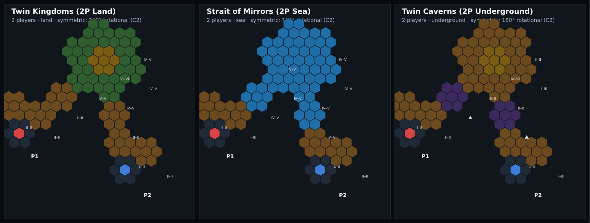

# Symmetric 2-player clash maps (land / sea / underground)

Three mirror-symmetric duel maps — one per terrain — for the lobby's scenario
list. (3- and 4-player versions are deferred until this 2-player design is
confirmed.) Properties are enforced by tests in
[`src/engine/symmetric-scenarios.test.ts`](../../src/engine/symmetric-scenarios.test.ts);
the images are rendered from the real game state (`npm run render:maps`).



## Shared shape

Each map reflects onto itself across the axis through the Ⅵ–Ⅶ hub, so **both
homes are identical**. Homes sit on the **outer edge** and march inward; the
terrain shifts from land at the edge to the "deep" middle:

| Terrain | Edge / outer ring | Middle ring | Hub (centre) |
|--|--|--|--|
| **Land** (Twin Kingdoms) | faction home · Ⅱ–Ⅲ land | Ⅳ–Ⅴ land | Ⅵ–Ⅶ land |
| **Sea** (Strait of Mirrors) | faction home · Ⅱ–Ⅲ **land coast** | Ⅳ–Ⅴ **sea** | Ⅵ–Ⅶ **sea** |
| **Underground** (Twin Caverns) | faction home · Ⅱ–Ⅲ **land** | **Subterranean** caverns | Ⅵ–Ⅶ **land** |

Every home borders Ⅱ–Ⅲ land at both its NE and NW, and every faction's start
tile has at least one of those edges open — so **no faction is ever walled in**
(tested across all ten factions in both seats).

## Underground mechanics (the fix)

The two caverns sit in the middle but each touches **only Ⅱ–Ⅲ land** — never the
hub, a home, or a Ⅳ–Ⅴ tile. So each Subterranean Gate Token carves correctly:

- the **GATE** half on the Ⅱ–Ⅲ **land** (Surface) tile, and
- the **ENTRANCE** half in the **cavern** (Subterranean) tile.

The Ⅵ–Ⅶ hub is a **Surface land** tile reached only by **delving**: descend a
gate into a cavern, cross, and climb the gate up to the central land hub. A test
reveals the map and proves (via `canCrossEdge`) that the hub is reachable from a
home *only* across a gate.

Legend: coloured hex = a home (P1/P2) · `Ⅵ–Ⅶ` gold = hub · `Ⅳ–Ⅴ` green / `Ⅱ–Ⅲ`
brown = land rings · blue = sea · purple = Subterranean cavern.

## Regenerating the pictures

```
npm run render:maps          # writes PNGs to docs/symmetric-maps (set MAP_OUT to change)
```

The renderer (`scripts/render-symmetric-maps.test.ts`) runs under its own
`vitest.render.config.ts`, so it is never part of `npm test`.
